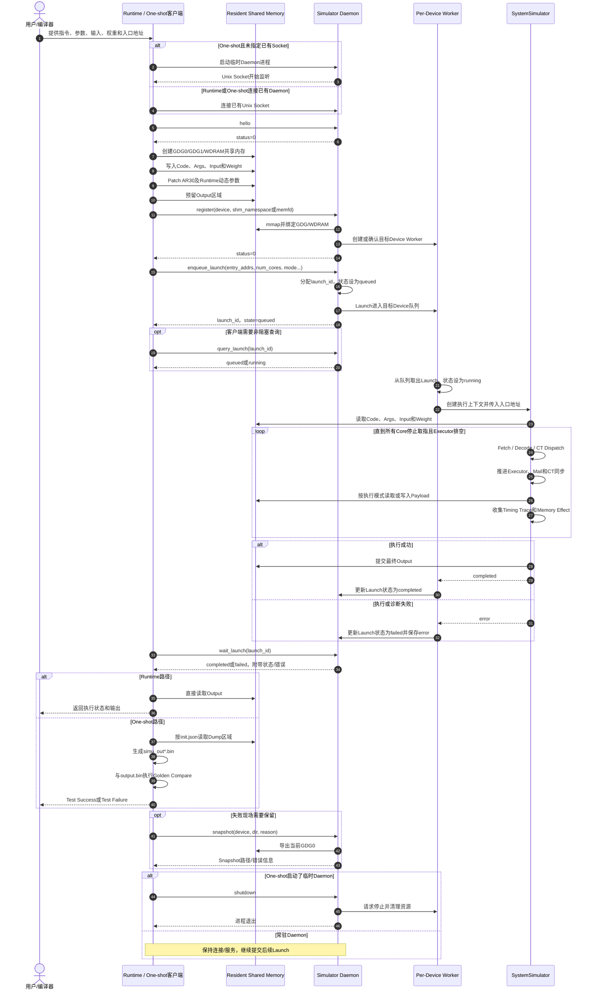

# Runtime / One-shot客户端与Daemon一次仿真任务时序图

> Runtime或One-shot客户端负责准备Resident Memory并通过控制协议提交Launch；Daemon负责映射内存、排队任务、执行指令并返回状态。大规模Code、Args、Input、Weight和Output通过共享内存传递，不通过控制Socket搬运。

## 1. 完整时序图（Mermaid）



## 2. PPT简化时序图

```text
用户/编译器        Runtime/One-shot       Shared Memory       Daemon          Device Worker/SystemSimulator
    │                     │                    │                  │                         │
    │ 指令/参数/输入/权重 │                    │                  │                         │
    ├────────────────────►│                    │                  │                         │
    │                     │                    │                  │                         │
    │                     │ 启动临时Daemon或连接已有Socket        │                         │
    │                     ├──────────────────────────────────────►│                         │
    │                     │ hello              │                  │                         │
    │                     ├──────────────────────────────────────►│                         │
    │                     │◄──────────────────────────── status=0 │                         │
    │                     │                    │                  │                         │
    │                     │ 创建并写入Code/Args/Input/Weight      │                         │
    │                     ├───────────────────►│                  │                         │
    │                     │                    │                  │                         │
    │                     │ register(device, namespace/memfd)     │                         │
    │                     ├──────────────────────────────────────►│                         │
    │                     │                    │◄──── mmap/bind ──┤                         │
    │                     │◄──────────────────────────── status=0 │                         │
    │                     │                    │                  │                         │
    │                     │ enqueue_launch(entry_addrs, mode)     │                         │
    │                     ├──────────────────────────────────────►│                         │
    │                     │                    │                  ├──── 加入Device队列 ─────►│
    │                     │◄──────── launch_id, state=queued      │                         │
    │                     │                    │                  │                         │
    │                     │ query_launch（可选）                  │                         │
    │                     ├──────────────────────────────────────►│                         │
    │                     │◄──────────────────── state=running    │                         │
    │                     │                    │                  │                         │
    │                     │                    │◄──────── 读取Code/Args/Input/Weight ────────┤
    │                     │                    │                  │    Fetch/Decode/Dispatch │
    │                     │                    │                  │    Executor/同步/Trace   │
    │                     │                    │◄─────────────── 写入Output ─────────────────┤
    │                     │                    │                  │◄──── completed/failed ───┤
    │                     │                    │                  │                         │
    │                     │ wait_launch(launch_id)                │                         │
    │                     ├──────────────────────────────────────►│                         │
    │                     │◄──────── completed/failed + error     │                         │
    │                     │                    │                  │                         │
    │                     │ 读取Output         │                  │                         │
    │                     │◄───────────────────┤                  │                         │
    │                     │                    │                  │                         │
    │                     │ One-shot：Dump + Golden Compare       │                         │
    │◄────────────────────┤ Runtime：直接返回Output/状态          │                         │
    │                     │                    │                  │                         │
    │                     │ 临时Daemon：shutdown                  │                         │
    │                     ├──────────────────────────────────────►│                         │
```

## 3. 一次仿真任务的阶段划分

| 阶段 | Runtime/One-shot客户端 | Daemon/SystemSimulator |
|---|---|---|
| 连接 | 启动临时Daemon或连接已有Socket，发送`hello` | 监听Socket并返回健康状态 |
| 数据准备 | 创建共享内存，写入Code、Args、Input、Weight | 尚不搬运Tensor数据 |
| Device注册 | 发送`register`及namespace或memfd | 映射并绑定GDG/WDRAM，建立Device Worker |
| 任务提交 | 发送`enqueue_launch` | 分配Launch ID并加入Device队列 |
| 异步执行 | 可查询状态或继续Host工作 | 执行Fetch、Decode、调度、Payload/Effect和Trace |
| 同步等待 | 发送`wait_launch` | 完成后返回`completed`或`failed` |
| 结果处理 | Runtime读取Output；One-shot执行Dump和Compare | 最终结果保存在Resident Memory |
| 诊断收尾 | 可请求Snapshot；临时Daemon需要Shutdown | 导出现场或继续服务后续Launch |

## 4. 控制通道与数据通道

```text
控制通道：AF_UNIX Socket
  hello / register / enqueue_launch
  query_launch / wait_launch
  snapshot / shutdown

数据通道：Resident Shared Memory
  Code / Args / Input / Weight / Output
```

设计价值：

- 避免通过JSON和Socket复制大规模Tensor；
- Daemon可常驻并连续处理多个Launch；
- Runtime和仿真器共享同一份Resident Memory；
- 控制消息保持轻量，执行状态和错误信息结构化返回；
- One-shot和外部Runtime最终复用同一条Daemon执行路径。

## 5. Runtime与One-shot的主要差异

| 对比项 | Runtime | One-shot客户端 |
|---|---|---|
| 输入来源 | Runtime内存分配及编译产物 | 传统Case目录和`init.json` |
| Daemon | 通常连接常驻Daemon | 可连接已有Daemon或自动启动临时Daemon |
| 内存准备 | Runtime直接准备Resident Memory | One-shot从Case文件加载到共享内存 |
| 结果读取 | Runtime直接从共享内存读取 | 按`init.json`生成`simu_out*.bin` |
| Golden Compare | 由上层决定 | One-shot自动执行 |
| 收尾 | Daemon通常继续常驻 | 临时Daemon在任务结束后关闭 |

## 6. 功能边界

- `enqueue_launch`返回`queued`只表示任务已进入队列，不表示执行完成；
- `wait_launch`返回`completed`表示Launch正常结束，不等于Golden一定通过；
- Code、Args和Tensor不通过控制Socket发送，必须在注册和Launch前写入Resident Memory；
- `stream_id`当前主要用于任务分类和`wait_stream`筛选，不代表完整硬件Stream调度；
- Topology在Daemon启动时确定，单次Launch不能动态覆盖远端路由；
- Snapshot是诊断导出，不是可恢复的完整执行Checkpoint。

## 7. 一句话总结

> 一次仿真任务由客户端完成“内存准备、Device注册、Launch提交和结果处理”，由Daemon完成“任务排队、系统仿真、状态管理和诊断输出”；控制信息走Socket，大规模数据走共享内存。
